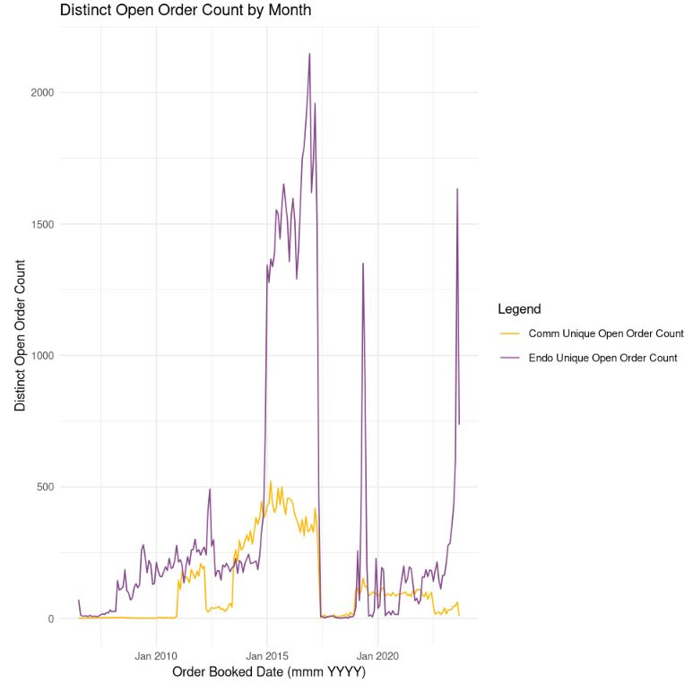
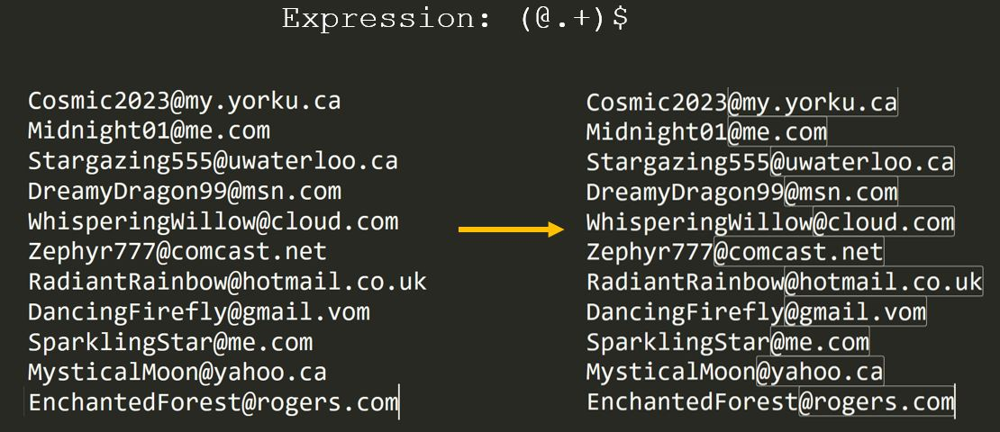

# Data Engineering
# Analytics Architecture
# & Innovative Automation

#### Last updated: March, 2026

*Parts of this portfolio have been obfuscated to protect privacy and security.*

---


- **Promoted consistently** — recognized for both technical depth and leadership impact
- End-to-end experience spanning **data engineering**, **analytics delivery strategy**, and **cross-functional program delivery**
- Operates at both the **strategic** and **execution** layers — from **roadmap design** to **hands-on delivery**
- Proven ability to balance and advance **multiple strategic priorities simultaneously**

---


---

## Leadership/Program Skills:

| Leadership Competency | Evidence |
| :--- | :--- |
| **Strategic Roadmap & Prioritization** | Designed and implemented a Data Analytics Delivery Strategy with a formalized project intake and organizational impact evaluation framework — enabling the team to prioritize the right work, accelerate delivery, and scale analytics output |
| **Mentorship & Talent Development** | Mentored peers and junior analytics professionals and Instructed 120+ students across multiple bootcamp cohorts (4.85/5 rating) |
| **Cross-Functional Team Leadership** | Led teams across IT, Finance, Commercial, Operations (Supply Planning, Manufacturing) and Business Enablement across multiple initiatives at Stryker |

---

## Hands-On Technical Skills

| Category | Tools |
| --- | --- |
| **Languages** | Python, R, Perl, SQL |
| **Cloud & Big Data** | Azure, Databricks, PySpark |
| **Databases** | PostgreSQL, SAP HANA BW |
| **Visualization** | Power BI |

---

## Projects

---
### Technical Program Leadership: Full Stack Data Engineering


A full-stack architecture diagram showing the end-to-end data pipeline for Supply Planning and Integrated Business Planning. Data flows from multiple source systems — Legacy ERPs (BPCS, PRMS), Data Warehouses (Artemis, Envision, SAP BW), SQL Server, SharePoint, and Unity Catalogue — through an orchestration layer comprising a Virtual Machine (SYK Gateway), **Azure Data Factory**, and **Databricks**. Data is served via a **PostgreSQL Server** and surfaced to decision makers through **Power BI**. A planned **Power Apps** layer is shown for future user input and self-service capability.

Delivered a multi-month data analytics program for Supply Planning and Integrated Business Planning in a $4bn business.

---
### Strategic Roadmap: Data Analytics Delivery Strategy


A four-phase Data Analytics Delivery Strategy roadmap, designed to drive immediate business impact while building a sustainable, scalable infrastructure. Each phase has a clear objective and set of deliverables:

- **Phase 1 – Discovery**: Team assembly, goal alignment, data discovery, project intake, and relationship building to orient the team and understand business processes.
- **Phase 2 – Visible Wins**: Requirements gathering, data quality fixes, semi-automation, KPI development, and migration from manual Excel processes to Python/R/Power BI to deliver quick, visible value.
- **Phase 3 – Build to Scale**: Data engineering on Azure Data Factory, data dictionary creation, internal team upskilling, change management, and best-in-class Power BI dashboard delivery.
- **Phase 4 – Infrastructure Set Up**: Standardized reporting, formalized architecture, data access & security (RLS), pipeline performance monitoring, query optimizations, and end-user communication.

---

### Project Details: Self-Serve Analytics


**The Power of Self-Service Analytics** - *give the people what they want, when they want it*

- Launched **two self-service Power BI dashboards** — among the **highest-usage** dashboards amongst the audience — to reduce ad-hoc requests and empower business users to access data on demand
- **Multi-dimensional filters and dynamic aggregations** designed around the most common ways users slice and aggregate data — spanning multiple data types, business units, product families, regions, facility types, sales reps, ship locations, part numbers, and rolling time periods
- Built on **certified, stamped "one source of truth"** data sources — ensuring consistent, trustworthy figures across all business decisions
- **Direct data delivery** to end users — no intermediaries, no waiting, no manual pulls
- Address a **myriad of business questions** without requiring analyst intervention for every request
- Free the **Data Engineering & Analytics team** from reactive ad-hoc work — enabling focus on long-term, sustainable, scalable solutions
- Reduce **organisational dependency** on individuals — institutional knowledge is embedded in the dashboard, not in a person

---

### Mentorship & Teaching: Data Analytics Instructor


A collage of feedback received as a Data Analytics Instructor and mentor. Highlights include:

- Recognition as **Project Lead** from the Canada PMO for driving technical and business leadership beyond a typical project lead role, delivering on time through perseverance and expertise.
- Praised for embracing **PMO adoption and culture change** as a strategic partner to the Canadian business.
- Described as *"skilled, creative, analytical and passionate"* with a learner mindset and high professionalism.
- Student bootcamp feedback noting he was *"far more competent"* than peers, offering extra sessions to support students and explaining concepts in a *"clear and well-paced manner."*
- Direct student messages expressing appreciation for mentoring in programming and encouraging continued growth.

---

### Technical Project Leadership: Lead vendor integration into internal BI Architecture


Managed a project to integrate a Territory Management & Inventive Compensation vendor into organization's internal business intelligence architecture. Project involved understanding the unique database objects, entity relationships, business processes and helping to architect the **Business Intelligence** infrastructure on **Azure**. Project involved in-depth understanding of Business Intelligence Architecture (Oracle **ERP**, Oracle **DWH**, **Cognos**, **Salesforce**, Middleware, **Azure**, External Vendor platform (on **AWS**), **Power BI**), **Project Leadership** skills, **Stakeholder Management** (IT, Business Leadership), **UAT/SIT**, **Functional User Requirements** Schedule development, **Benefit-Cost Financial Model (BCFM)** development, Go-Live and hypercare.

---

### Data Engineering: SQL Query Optimization

Initial Query:
```sql
SELECT *
FROM crm_name.user AS u
INNER JOIN crm_name.opportunities AS o ON o.CreatedById = u.Id
INNER JOIN crm_name.quotes AS q ON o.Id = q.BigMachines__Opportunity__c
INNER JOIN crm_name.opportunities_products AS op ON o.Id = op.OpportunityId
INNER JOIN crm_name.pricebook AS pb ON op.PriceBookEntryId = pb.Id
INNER JOIN crm_name.products AS p ON pb.Product2Id = p.Id
WHERE u.Email = 'mandhir@obfuscated.com'
AND TO_CHAR (o.CreatedDate, 'YYYY') >= 2017
ORDER BY Quote_Number,
Product_Code;

```

Optimized Query:

```sql
SELECT
u.Name AS User_Name,
o.Name AS Opportunity_Name,
q.Name AS Quote_Number,
p.ProductCode AS Product_Code,
SUM(op.Quantity) AS Quantity,
FROM crm_name.user AS u
INNER JOIN crm_name.opportunities AS o ON o.CreatedById = u.Id
INNER JOIN crm_name.quotes AS q ON o.Id = q.BigMachines__Opportunity__c
INNER JOIN crm_name.opportunities_products AS op ON o.Id = op.OpportunityId
INNER JOIN crm_name.pricebook AS pb ON op.PriceBookEntryId = pb.Id
INNER JOIN crm_name.products AS p ON pb.Product2Id = p.Id
WHERE 1=1
AND u.Email = 'mandhir@obfuscated.com'
AND o.CreatedDate >= '2019-01-01'
AND o.Quote_type IN (7091, 7094, 6933)
GROUP BY User_Name, Opportunity_Name, Quote_Number, Product_Code
HAVING Quote_Number NOT LIKE '0000%'
ORDER BY User_Name, Opportunity_Name, Quote_Number, Product_Code;
```

Conducted **SQL** query optimization projects in collaboration with downstream users, such as the aforementioned example. A number of optimizations have been performed in this example:
1. Selecting only the columns requested by downstream users
2. Selecting only record types that are required by users
3. Ensuring that the query is sargable. Ensuring that the database engine can use indexes or can compare to a value that is of the same data type as the data in the column thereby ensuring more efficient index utilization
4. [General rule] Understanding and optimizing based on order of SQL query execution (FROM, JOIN, WHERE, GROUP BY, HAVING, SELECT, ORDER BY, LIMIT) and by using EXPLAIN & ANALYZE

This **Data Engineering** project involved enhancing data model performance, reducing resource consumption and costs, improving scalability, and optimizing the user experience for report and dashboard creators and analysts. Notably, this complex sales reporting query was streamlined by implementing filters, efficient table joining, and appropriate indexing, resulting in a 50% reduction in query execution time and a 25% decrease in resource consumption. Leveraging data profiling and performance testing, I thoroughly understood the data, identified optimization areas, and validated the outcomes of these optimizations.

---

### Power BI: Analysis of Opportunities in Salesforce


The above is an example of a dashboard that I built which allows commercial partners to analyze quotes and opportunities data from **Salesforce**. The project involved Complex data modeling from Salesforce (above left), understanding user requirements, Salesforce objects, **Power BI** and complex **DAX** formulas.

---

### Databricks/Azure: R visualization from Combo deals project



[Code Snippet: Data Wrangling and Visualization in R](./code_snippets/wrangling_and_ggplot_visual_in_R.R)

This project is a recent example of analysis that I performed in **R** of Orders and customer data. I retrieved data from **SQL Server** (served on **Azure**) on **Databricks** and presented my findings through advanced **data visualization** techniques using the **ggplot2** library revealing trends in open order counts over time for different organizational units.

---

### Technical Project Leadership: Transitioning from Cognos reporting to Power BI

Lead the business enablement workstream of the migration of reporting and analytics from **IBM Cognos** to **Power BI**. The leading of the workstream involved user-centric dashboard creation in Power BI, documentation of requirements, the user of **Azure Analysis Services** and conducting comprehensive end-user training on **Power BI** and **DAX**. I collaborated with **multiple stakeholders** (Commercial leadership, IT) and worked to establish dashboards with visuals tailored for commercial decision-making. This project has given me a deep understanding of the strategic commercial decision-making process.

---
### Innovative Automation: Automated email requests for information


Developed a script that automatically responded to requests for information sent by front-line personnel. The script (originally developed in R and Perl) was then developed in Python - monitored a unified inbox for email requests for information. Upon receipt of a relevant email, the script would extract customer identifiers, item numbers and the nature of the information asked for, gather the data requested, format a excel workbook and provide the data requested as an attachment to the sender. This script called "auto-responder" served internal users and saved the team it supported several hours of manual data gathering and saved recipient teams from any human errors.

[Link to script/repository]()

---

### Data Engineering eliminated need for external vendor


- Engineered a data availability pipeline in **Perl and R** to process **25GB / ~14 million rows** of contracts and pricing data retrieved from Oracle
- Built a structured 9-step pipeline covering data ingestion, cleaning, deduplication, segmentation, filtering, and output generation
- Delivered formatted Excel reports for Sales & Marketing, eliminating reliance on an external vendor and saving the organisation **>€10,000 per year**
- Solutions written across **Perl** (script coordination), **R** (dataframe manipulation), and **Python** (automation and orchestration)

---

### Innovative Automation: Automated Pricing Discrepancies resolution

A problem that our team faced was invoicing delays due to pricing errors. The team would receive emails from front-line personnel asking questions regarding pricing. Team members would manually search for correct pricing and coordinate communication with front-line personnel and marketing. I automated this process through business process mapping, developing scripts in (originally R and Perl) and then Python. These scripts extracted data from our data warehouse, processed the errors that required coordination with marketing and sales reps, identified the appropriate stakeholders, emailed them and provided responses to pricing teams members for downstream execution of the resolution of those errors. This automation saved over $100,000 annually in collected invoices and saved over 2000+ hours of manual work.

---

### Data Cleansing: Working with Regular Expressions

Regular expressions (regex), serving as a potent tool for defining search patterns using sequences of characters, are pivotal in both **data cleansing** and **data transformation** processes. These versatile patterns allow for precise searching, editing, and manipulation, playing a vital role in optimizing data quality and formatting data for analysis. I have extensively utilized regex in numerous projects, especially in **R**, **Python**, and **Perl**, to achieve effective data cleansing and seamless data transformations. Here is a simple example:



---

## Additional Certifications/Experience
- 2022	 - 	Advanced SQL	_Global Knowledge_
- 2022	 - 	AWS Cloud Practitioner Essentials	_Global Knowledge_
- 2022	 - 	Implementing a Data Science Solution on Azure	_Global Knowledge_
- 2022	 - 	Data Engineering on Azure (DP-203T00)	_Global Knowledge_
- 2022	 - 	Applied Python in Data Science	_Global Knowledge_
- 2022	 - 	Azure Fundamentals – AZ-900	_Microsoft_
- 2021	 - 	Analyzing Data with Microsoft PowerBI (DA-100T00)	_Microsoft_
- 2020	 - 	Supervised Learning in R: Classification	_DataCamp_
- 2019	 - 	Machine Learning	_Prof Andrew Ng - Coursera_
- 2019	 - 	Python for Data Science: Intermediate	_DataQuest_
- 2019	 - 	Data Analysis with Python	_Coursera_
- 2019	 - 	Data Visualization with Python	_Coursera_
- 2019	 - 	Python for Data Science and AI	_Coursera_
- 2018	 - 	Data Analytics in Business	_Sridhar Narasimhan, PhD_
- 2018	 - 	Computing for Data Analysis	_Richard Vuduc, PhD_
- 2018	 - 	Analytics Modelling	_Joel Sokol, PhD_
- 2016	 - 	Programming with Java	_Seneca College_
- 2016	 - 	Applied Statistics	_Seneca College_
- 2015	 - 	Programming with Perl	_Seneca College_
